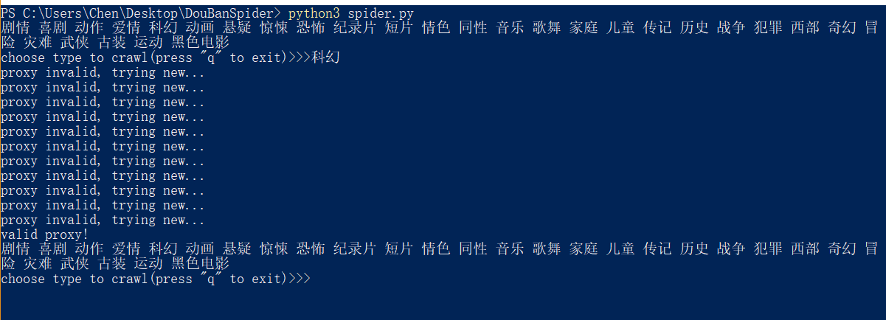
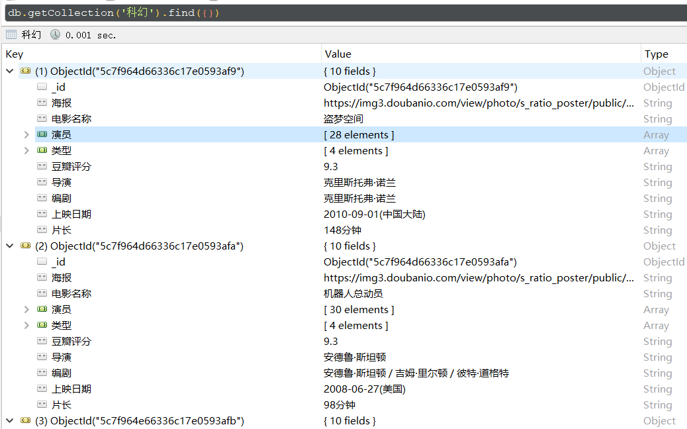

### 开发环境
- python 3.6.4

### 配置开发环境
- 切换到DouBanSpider目录下, 执行下面的命令
pip install -r requirements.txt

### 启动项目
- 切换到DouBanSpider目录下，执行shell
python3 spider.py

### 数据库结果（Robo 3T version-1.2查看）

### ps
- 使用公共代理，难免可用性差，程序已设置自动爬取代理，请耐心等待
    

